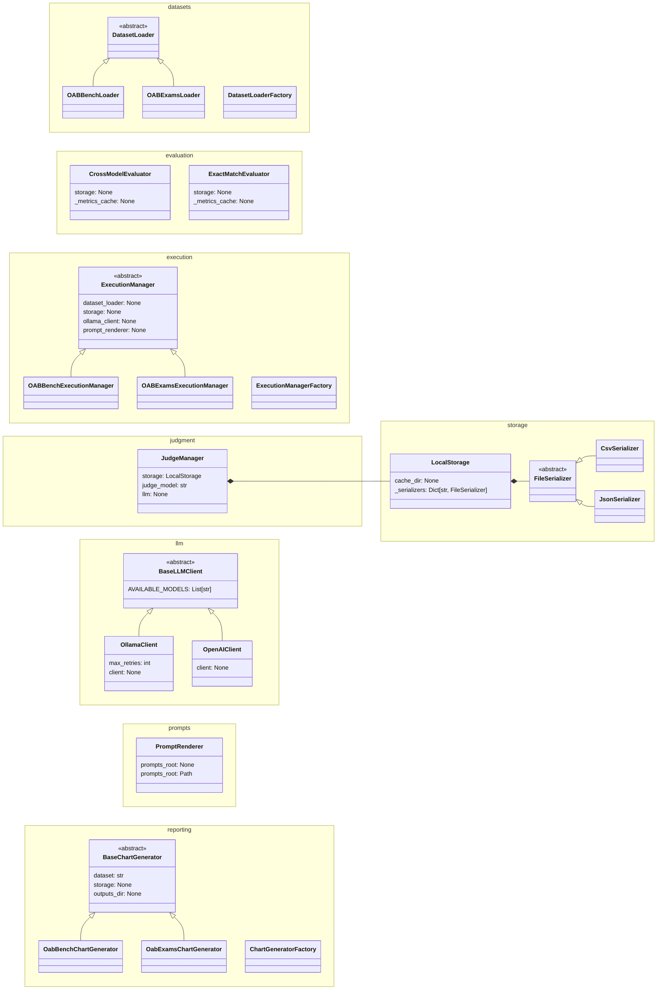

[Português](./README.md) | English

<div align="center">


<h1>Advanced Topics in SE and IS</h1>

<p>Assessment Activity 1: Dataset Curation and Basic Inference with LLMs</p>

<p align="center">
  <!-- Python version -->
  
  <!-- License -->
  <a href="LICENSE">
    
  </a>
  <!-- Quality Gate Status -->
  <a href="https://sonarcloud.io/project/overview?id=ReinanHS_Topicos_Avancados_2026_1_Equipe_JUD_3_atividade1">
    
  </a>
  <!-- Last commit -->
  <a href="https://github.com/reinanhs/Topicos_Avancados_2026_1_Equipe_JUD_3_atividade1/commits/main">
    
  </a>
  <!-- Stars -->
  <a href="https://github.com/reinanhs/Topicos_Avancados_2026_1_Equipe_JUD_3_atividade1/stargazers">
    
  </a>
  <!-- SonarCloud -->
  <a href="https://sonarcloud.io/project/overview?id=ReinanHS_Topicos_Avancados_2026_1_Equipe_JUD_3_atividade1">
    
  </a>
</p>

[](https://codespaces.new/reinanhs/Topicos_Avancados_2026_1_Equipe_JUD_3_atividade1?machine=standardLinux2gb)

<p align="center">
  <a href="https://reinanhs.github.io/Topicos_Avancados_2026_1_Equipe_JUD_3_atividade1/docs">Documentation</a>
  ·
  <a href="https://github.com/ReinanHS/Topicos_Avancados_2026_1_Equipe_JUD_3_atividade1/tree/results">Results</a>
  ·
  <a href="https://youtu.be/lcOxhH8N3Bo">Demo video</a>
  ·
  <a href="https://reinanhs.github.io/Topicos_Avancados_2026_1_Equipe_JUD_3_atividade1/contribuicao-individual.pdf">PDF tutorial</a>
</p>

</div>

<details>
<summary>Table of Contents (Click to expand)</summary>

- [📚 About](#-about)
- [📖 Documentation](#-documentation)
  - [How to access](#how-to-access)
- [📹 Presentation](#-presentation)
- [👥 Contributors](#-contributors)
- [Execution environment](#execution-environment)
  - [Hardware configuration](#hardware-configuration)
  - [Language models](#language-models)
- [Execution instructions](#execution-instructions)
  - [Prerequisites](#prerequisites)
  - [Installation and execution](#installation-and-execution)
- [Results](#results)
- [Architecture](#architecture)
- [Contributions](#contributions)
- [Changelog](#changelog)
- [Security](#security)
- [📄 License](#-license)
- [Citation](#citation)
- [References](#references)
</details>

## 📚 About

This repository contains the individual contributions of student Reinan Gabriel to the first assessment activity of the course **Advanced Topics in Software Engineering and Information Systems I** (UFS 2026.1).

The project covers two main fronts:

- **Legal dataset curation:** difficulty-level classification and identification of the underlying legislation in questions from the [OAB Bench][oab-bench] and [OAB Exams][oab-exams] datasets.
- **Inference with local LLMs:** execution of compact models (Llama 3.2, Gemma 2, and Qwen 2.5) via Ollama on Brazilian Bar Exam questions, with automatic evaluation using BLEU, ROUGE, and BERTScore metrics.

[oab-bench]: https://huggingface.co/datasets/maritaca-ai/oab-bench
[oab-exams]: https://huggingface.co/datasets/eduagarcia/oab_exams

## 📖 Documentation

This repository adopts the **Docs-as-Code** approach. In this model, the documentation lives alongside the code in the `docs/` directory and follows the same versioning, review, and CI/CD workflow. This practice is recommended by the [Google Style Guide for documentation](https://github.com/google/styleguide/tree/gh-pages/docguide). The guide advocates that engineers use the same tools for code and documentation and highlights that Markdown is superior to opaque formats because it is portable and readable.

### How to access

- **In the repository:** start with the introduction in [`docs/intro.md`][docs-intro].
- **On the web:** access the [published documentation][docs-web], automatically built on every push to the `main` branch.


> For a more detailed introduction to this approach, read the article [Docs-as-Code: a basic guide for beginners][docs-as-code-artigo].

[docs-intro]: docs/intro.md
[docs-web]: https://reinanhs.github.io/Topicos_Avancados_2026_1_Equipe_JUD_3_atividade1/docs
[docs-as-code-artigo]: https://medium.com/@reinanhs/docs-as-code-um-guia-b%C3%A1sico-para-iniciantes-b65b1e63b53a
[docusaurus]: https://docusaurus.io/

## 📹 Presentation

The following video shows the results collected by the team, including the contributions of Reinan Gabriel:

[](https://youtu.be/lcOxhH8N3Bo)

- **Watch the full video:** [https://youtu.be/lcOxhH8N3Bo](https://youtu.be/lcOxhH8N3Bo)

The presentation is available in the following formats:

| Format | Link |
|--------|------|
| HTML | [apresentacao-marp.html](https://reinanhs.github.io/Topicos_Avancados_2026_1_Equipe_JUD_3_atividade1/apresentacao-marp.html) |
| PDF | [apresentacao-marp.pdf](https://reinanhs.github.io/Topicos_Avancados_2026_1_Equipe_JUD_3_atividade1/apresentacao-marp.pdf) |
| PPTX | [apresentacao-marp.pptx](https://reinanhs.github.io/Topicos_Avancados_2026_1_Equipe_JUD_3_atividade1/apresentacao-marp.pptx) |

## 👥 Contributors

This repository contains the contributions made by student **Reinan Gabriel** in the context of **Assessment Activity 1** of the course **Advanced Topics in Software Engineering and Information Systems I**, taught at the Federal University of Sergipe (UFS), semester 2026.1.

<div align="center">
<table align="center">
  <tr>
    <td align="center">
      <a href="https://github.com/ReinanHS">
        
      </a><br/>
      <a href="https://github.com/ReinanHS">Reinan Gabriel</a>
    </td>
  </tr>
</table>
</div>

---

## Execution environment

### Hardware configuration

The team ran the inference experiments on a local machine with the following GPU:

| Component                | Specification           |
|--------------------------|-------------------------|
| **GPU**                  | NVIDIA GeForce GTX 1050 |
| **Dedicated VRAM**       | 4.0 GB                  |
| **Shared memory**        | 8.0 GB                  |
| **Driver version**       | 32.0.15.8228            |
| **Driver date**          | 2026-01-20              |
| **DirectX version**      | 12 (FL 12.1)            |

The GPU has **4 GB of dedicated VRAM**. This limitation restricted the selection to compact LLMs of up to **3B parameters** in quantized versions.

- [Hardware configuration details](https://reinanhs.github.io/Topicos_Avancados_2026_1_Equipe_JUD_3_atividade1/docs/inference/hardware)

### Language models

The project uses **three models** from different organizations to diversify architectures and training bases. [Ollama](https://ollama.com/) runs all models locally.

| # | Model        | Developer     | Parameters | Quantization |
|---|--------------|---------------|------------|--------------|
| 1 | Llama 3.2 3B | Meta          | 3.21B      | Q4_K_M       |
| 2 | Gemma 2 2B   | Google        | 2.61B      | Q4_0         |
| 3 | Qwen 2.5 3B  | Alibaba Cloud | 3.09B      | Q4_K_M       |

- [Documentation about the language models](https://reinanhs.github.io/Topicos_Avancados_2026_1_Equipe_JUD_3_atividade1/docs/inference/models)

---

---

## Results

The table below presents a summary of the performance of the evaluated models across the two fronts of the project. For multiple-choice questions (OAB Exams), accuracy was used as the main metric. For discursive questions (OAB Bench), the average BERTScore F1 against the guideline and the score assigned by the judge model (GPT-4o-mini) were considered.

| Model           | Accuracy (OAB Exams) | BERTScore F1 vs Guideline | Judge Score |
|-----------------|----------------------|----------------------------|-------------|
| **gemma2:2b**   | 0.4344               | 0.6569                     | 0.120       |
| **llama3.2:3b** | 0.3607               | 0.6632                     | 0.139       |
| **qwen2.5:3b**  | 0.4180               | 0.6513                     | 0.189       |

**gemma2:2b** achieved the highest accuracy on multiple-choice questions, while **qwen2.5:3b** stood out in the judge’s qualitative evaluation for discursive questions. The complete results, including detailed charts and per-question analyses, are available in the [branch `results`][branch_results].

- [Click here to view the results][branch_results]

[branch_results]: https://github.com/ReinanHS/Topicos_Avancados_2026_1_Equipe_JUD_3_atividade1/tree/results

---

## Execution instructions

### Prerequisites

Make sure your environment includes the following tools:

| Requirement                                   | Minimum version | Description                                 |
|----------------------------------------------|-----------------|---------------------------------------------|
| [Python](https://www.python.org/downloads/)   | 3.12+           | Main programming language of the project    |
| [UV](https://docs.astral.sh/uv/#installation) | 0.10+           | Python dependency and environment manager   |
| [Ollama](https://ollama.com/download)         | 0.19+           | Runtime for local model execution           |
| [Git](https://git-scm.com/install)            | 2.x             | Version control                             |

- [Documentation about the prerequisites](https://reinanhs.github.io/Topicos_Avancados_2026_1_Equipe_JUD_3_atividade1/docs/getting-started/prerequisites)

### Installation and execution

For complete instructions, see the guides:

- [Installation and execution](https://reinanhs.github.io/Topicos_Avancados_2026_1_Equipe_JUD_3_atividade1/docs/getting-started/installation)
- [Quick start guide](https://reinanhs.github.io/Topicos_Avancados_2026_1_Equipe_JUD_3_atividade1/docs/getting-started/quick-start)

To run the project locally, follow these steps:

```bash
# (Optional) Create and activate a virtual environment
python -m venv .venv

# Activation on Linux/macOS
source .venv/bin/activate

# Activation on Windows (PowerShell)
# .venv\Scripts\activate

# Install dependencies
uv sync

# Run the main script
uv run reinan-cli --help
````

---

## Architecture

The following diagram illustrates the project's classes and their relationships:



---

## Contributions

See the file [CONTRIBUTING.md](CONTRIBUTING.md).

## Changelog

See the file [CHANGELOG.md](CHANGELOG.md).

## Security

See the file [SECURITY.md](SECURITY.md).

## License

This project uses the MIT License. See the [LICENSE](LICENSE) file for the full terms.

## Citation

To cite this repository, use the following BibTeX entry:

```bibtex
@software{reinan_hs_2026_1_equipe_jud_3_atividade1,
  author       = {Souza, Reinan Gabriel},
  title        = {Topicos_Avancados_2026_1_Equipe_JUD_3_atividade1},
  year         = {2026},
  month        = {4},
  publisher    = {GitHub},
  url          = {https://github.com/ReinanHS/Topicos_Avancados_2026_1_Equipe_JUD_3_atividade1},
  version      = {1.0.0}
}
```

## References

The references below represent the main sources used during the development of this project, covering everything from documentation practices to language model evaluation methodologies.

* [Docs-as-Code: a basic guide for beginners](https://medium.com/@reinanhs/docs-as-code-um-guia-b%C3%A1sico-para-iniciantes-b65b1e63b53a)
* [Standardization of Teaching Materials with Marp and CI/CD: A Study at the Federal Institute of Sergipe](https://doi.org/10.34178/jbth.v7iSuppl2.450)
* [Google Developer Documentation Style Guide](https://github.com/google/styleguide/tree/gh-pages/docguide)
* [Best Practices and Methods for LLM Evaluation](https://www.databricks.com/br/blog/best-practices-and-methods-llm-evaluation)
* [LLM Evaluation Metrics: Everything You Need for LLM Evaluation](https://www.confident-ai.com/blog/llm-evaluation-metrics-everything-you-need-for-llm-evaluation)
* [LLM Evaluation: A Comprehensive Survey](https://arxiv.org/html/2504.21202v1)
* [OAB Bench](https://github.com/maritaca-ai/oab-bench)
* [OAB Exams](https://huggingface.co/datasets/eduagarcia/oab_exams)
* [Ollama](https://ollama.com/)

---

<div align="center">
  <sub>Developed by Team 3 (Legal Domain) | UFS 2026.1</sub>
</div>
