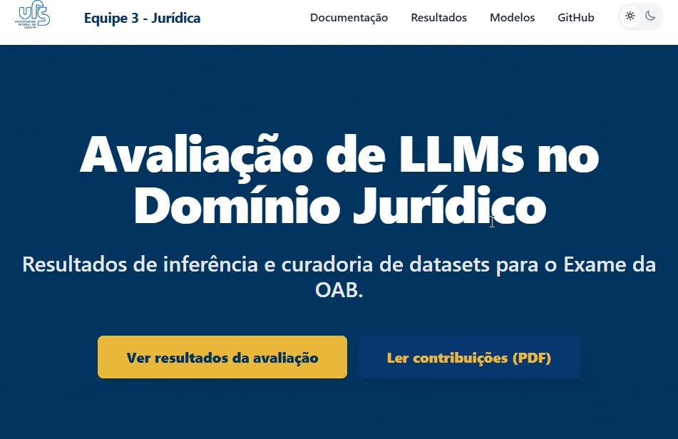
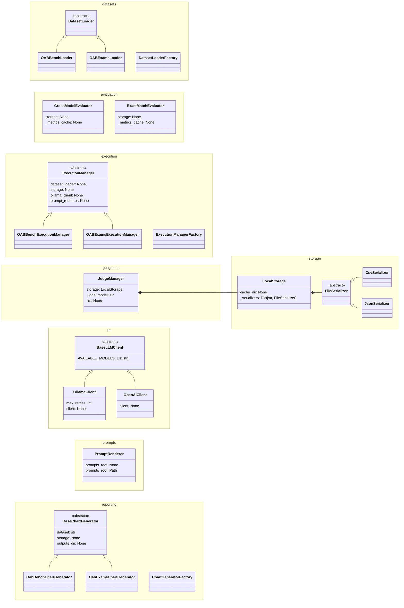

Português | [English](./README-EN.md)

<div align="center">


<h1>Tópicos Avançados ES e SI</h1>

<p>Atividade Avaliativa 1: Curadoria de Datasets e Inferência Básica com LLMs</p>

<p align="center">
  <!-- Python version -->
  
  <!-- License -->
  <a href="LICENSE">
    
  </a>
  <!-- Quality Gate Status -->
  <a href="https://sonarcloud.io/project/overview?id=ReinanHS_Topicos_Avancados_2026_1_Equipe_JUD_3_atividade1">
    
  </a>
  <!-- Last commit -->
  <a href="https://github.com/reinanhs/Topicos_Avancados_2026_1_Equipe_JUD_3_atividade1/commits/main">
    
  </a>
  <!-- Stars -->
  <a href="https://github.com/reinanhs/Topicos_Avancados_2026_1_Equipe_JUD_3_atividade1/stargazers">
    
  </a>
  <!-- SonarCloud -->
  <a href="https://sonarcloud.io/project/overview?id=ReinanHS_Topicos_Avancados_2026_1_Equipe_JUD_3_atividade1">
    
  </a>
</p>

[](https://codespaces.new/reinanhs/Topicos_Avancados_2026_1_Equipe_JUD_3_atividade1?machine=standardLinux2gb)

<p align="center">
  <a href="https://reinanhs.github.io/Topicos_Avancados_2026_1_Equipe_JUD_3_atividade1/docs">Documentação</a>
  ·
  <a href="https://reinanhs.github.io/Topicos_Avancados_2026_1_Equipe_JUD_3_atividade1/apresentacao-marp.html">Apresentação</a>
  ·
  <a href="https://youtu.be/lcOxhH8N3Bo">Vídeo de demonstração</a>
  ·
  <a href="https://reinanhs.github.io/Topicos_Avancados_2026_1_Equipe_JUD_3_atividade1/contribuicao-individual.pdf">Tutorial em PDF</a>
</p>

</div>

<details>
<summary>Sumário (Clique para expandir)</summary>

- [📚 Sobre](#-sobre)
- [📖 Documentação](#-documentação)
  - [Como acessar](#como-acessar)
- [📹 Apresentação](#-apresentação)
- [👥 Colaboradores](#-colaboradores)
- [Ambiente de execução](#ambiente-de-execução)
  - [Configuração de hardware](#configuração-de-hardware)
  - [Modelos de linguagem](#modelos-de-linguagem)
- [Instruções de execução](#instruções-de-execução)
  - [Pré-requisitos](#pré-requisitos)
  - [Instalação e execução](#instalação-e-execução)
- [Arquitetura](#arquitetura)
- [Contribuições](#contribuições)
- [Changelog](#changelog)
- [Segurança](#segurança)
- [📄 Licença](#-licença)
- [Cite](#cite)
</details>

## 📚 Sobre

Este repositório contém as contribuições individuais do aluno Reinan Gabriel para a primeira atividade avaliativa da disciplina **Tópicos Avançados em Engenharia de Software e Sistemas de Informação I** (UFS 2026.1).

O projeto abrange duas frentes principais:

- **Curadoria de datasets jurídicos:** classificação de nível de dificuldade e identificação da legislação-base em questões dos datasets [OAB Bench][oab-bench] e [OAB Exams][oab-exams].
- **Inferência com LLMs locais:** execução de modelos compactos (Llama 3.2, Gemma 2 e Qwen 2.5) via Ollama sobre questões do Exame da OAB, com avaliação automática por métricas BLEU, ROUGE e BERTScore.

[oab-bench]: https://huggingface.co/datasets/maritaca-ai/oab-bench
[oab-exams]: https://huggingface.co/datasets/eduagarcia/oab_exams

## 📖 Documentação

Este repositório utiliza a abordagem **Docs-as-Code**. Nele, a documentação reside junto ao código no diretório `docs/` e segue o mesmo fluxo de versionamento, revisão e CI/CD. Essa prática é recomendada pelo [Google Style Guide para documentação](https://github.com/google/styleguide/tree/gh-pages/docguide). O guia defende que engenheiros usem as mesmas ferramentas do código para a documentação e destaca que o Markdown é superior a formatos opacos por ser portável e legível.

### Como acessar

- **No repositório:** comece pela introdução em [`docs/intro.md`][docs-intro].
- **Na web:** acesse a [documentação publicada][docs-web], compilada automaticamente a cada push na branch `main`.



> Para uma introdução mais detalhada a essa abordagem, leia o artigo [Docs-as-Code: um guia básico para iniciantes][docs-as-code-artigo].

[docs-intro]: docs/intro.md
[docs-web]: https://reinanhs.github.io/Topicos_Avancados_2026_1_Equipe_JUD_3_atividade1/docs
[docs-as-code-artigo]: https://medium.com/@reinanhs/docs-as-code-um-guia-b%C3%A1sico-para-iniciantes-b65b1e63b53a
[docusaurus]: https://docusaurus.io/

## 📹 Apresentação

O vídeo a seguir mostra os resultados coletados pela equipe, incluindo as contribuições de Reinan Gabriel:

[](https://youtu.be/lcOxhH8N3Bo)

- **Assista ao vídeo completo:** [https://youtu.be/lcOxhH8N3Bo](https://youtu.be/lcOxhH8N3Bo)

A apresentação está disponível nos seguintes formatos:

| Formato | Link |
|---------|------|
| HTML | [apresentacao-marp.html](https://reinanhs.github.io/Topicos_Avancados_2026_1_Equipe_JUD_3_atividade1/apresentacao-marp.html) |
| PDF | [apresentacao-marp.pdf](https://reinanhs.github.io/Topicos_Avancados_2026_1_Equipe_JUD_3_atividade1/apresentacao-marp.pdf) |
| PPTX | [apresentacao-marp.pptx](https://reinanhs.github.io/Topicos_Avancados_2026_1_Equipe_JUD_3_atividade1/apresentacao-marp.pptx) |

## 👥 Colaboradores

Este repositório contém as contribuições realizadas pelo aluno **Reinan Gabriel** no contexto da **Atividade Avaliativa 1** da disciplina **Tópicos Avançados em Engenharia de Software e Sistemas de Informação I**, ministrada na Universidade Federal de Sergipe (UFS), semestre 2026.1.

<div align="center">
<table align="center">
  <tr>
    <td align="center">
      <a href="https://github.com/ReinanHS">
        
      </a><br/>
      <a href="https://github.com/ReinanHS">Reinan Gabriel</a>
    </td>
  </tr>
</table>
</div>

---

## Ambiente de execução

### Configuração de hardware

A equipe executou os experimentos de inferência em uma máquina local com a seguinte GPU:

| Componente                | Especificação           |
|---------------------------|-------------------------|
| **GPU**                   | NVIDIA GeForce GTX 1050 |
| **VRAM dedicada**         | 4,0 GB                  |
| **Memória compartilhada** | 8,0 GB                  |
| **Versão do driver**      | 32.0.15.8228            |
| **Data do driver**        | 20/01/2026              |
| **Versão do DirectX**     | 12 (FL 12.1)            |

A GPU possui **4 GB de VRAM dedicada**. Essa restrição limitou a seleção a LLMs compactos de até **3B parâmetros** em versões quantizadas.

- [Detalhes da configuração de hardware](https://reinanhs.github.io/Topicos_Avancados_2026_1_Equipe_JUD_3_atividade1/docs/inference/hardware)

### Modelos de linguagem

O projeto utiliza **três modelos** de organizações distintas para diversificar arquiteturas e bases de treinamento. O [Ollama](https://ollama.com/) executa todos os modelos de forma local.

| # | Modelo       | Desenvolvedor | Parâmetros | Quantização |
|---|--------------|---------------|------------|-------------|
| 1 | Llama 3.2 3B | Meta          | 3,21B      | Q4_K_M      |
| 2 | Gemma 2 2B   | Google        | 2,61B      | Q4_0        |
| 3 | Qwen 2.5 3B  | Alibaba Cloud | 3,09B      | Q4_K_M      |

- [Documentação sobre os modelos de linguagem](https://reinanhs.github.io/Topicos_Avancados_2026_1_Equipe_JUD_3_atividade1/docs/inference/models)

---

## Instruções de execução

### Pré-requisitos

Verifique se o seu ambiente possui as seguintes ferramentas:

| Requisito                                     | Versão mínima | Descrição                                      |
|-----------------------------------------------|---------------|-------------------------------------------------|
| [Python](https://www.python.org/downloads/)   | 3.12+         | Linguagem principal do projeto                  |
| [UV](https://docs.astral.sh/uv/#installation) | 0.10+         | Gerenciador de dependências e ambientes Python  |
| [Ollama](https://ollama.com/download)         | 0.19+         | Runtime para execução local dos modelos         |
| [Git](https://git-scm.com/install)            | 2.x           | Controle de versão                              |

- [Documentação sobre os pré-requisitos](https://reinanhs.github.io/Topicos_Avancados_2026_1_Equipe_JUD_3_atividade1/docs/getting-started/prerequisites)

### Instalação e execução

Para instruções completas, consulte os guias:

- [Instalação e execução](https://reinanhs.github.io/Topicos_Avancados_2026_1_Equipe_JUD_3_atividade1/docs/getting-started/installation)
- [Guia rápido](https://reinanhs.github.io/Topicos_Avancados_2026_1_Equipe_JUD_3_atividade1/docs/getting-started/quick-start)

Para executar o projeto de forma local, siga os passos:

```bash
# (Opcional) Criar e ativar um ambiente virtual
python -m venv .venv

# Ativação no Linux/macOS
source .venv/bin/activate

# Ativação no Windows (PowerShell)
# .venv\Scripts\activate

# Instalar as dependências
uv sync

# Executar o script principal
uv run reinan-cli --help
```

---

## Arquitetura

O diagrama a seguir ilustra as classes do projeto e seus relacionamentos:



---

## Contribuições

Consulte o arquivo [CONTRIBUTING.md](CONTRIBUTING.md).

## Changelog

Consulte o arquivo [CHANGELOG.md](CHANGELOG.md).

## Segurança

Consulte o arquivo [SECURITY.md](SECURITY.md).

## Licença

Este projeto utiliza a Licença MIT. Consulte o arquivo [LICENSE](LICENSE) para os termos completos.

## Citação

Para citar este repositório, use a entrada BibTeX:

```bibtex
@software{reinan_hs_2026_1_equipe_jud_3_atividade1,
  author       = {Souza, Reinan Gabriel},
  title        = {Topicos_Avancados_2026_1_Equipe_JUD_3_atividade1},
  year         = {2026},
  month        = {4},
  publisher    = {GitHub},
  url          = {https://github.com/ReinanHS/Topicos_Avancados_2026_1_Equipe_JUD_3_atividade1},
  version      = {1.0.0}
}
```

---

<div align="center">
  <sub>Desenvolvido pela Equipe 3 (Domínio Jurídico) | UFS 2026.1</sub>
</div>
