# Resultados da avaliação automática

Este documento apresenta os principais resultados obtidos na avaliação automática dos modelos **gemma2:2b**, **llama3.2:3b** e **qwen2.5:3b** nos datasets OAB Exams e OAB Bench. Os gráficos e tabelas foram gerados automaticamente pelo pipeline de avaliação do projeto.

---

## OAB Exams: Avaliação exata

O dataset OAB Exams contém questões objetivas com gabarito oficial, permitindo uma avaliação direta da capacidade dos modelos em selecionar a alternativa correta. Foram utilizadas as métricas clássicas de classificação: Acurácia, Precisão, Recall e F1-Score.

### Métricas por modelo

| Modelo | Acurácia | Precisão | Recall | F1 Score |
|---|---|---|---|---|
| **gemma2-2b** | 0.3821 | 0.3784 | 0.3847 | 0.3528 |
| **llama3.2-3b** | 0.3984 | 0.3215 | 0.3188 | 0.3178 |
| **qwen2.5-3b** | 0.4065 | 0.3309 | 0.3281 | 0.3245 |

### Comparação visual das métricas exatas

O gráfico de barras abaixo permite comparar visualmente o desempenho de cada modelo nas quatro métricas de avaliação exata. É possível notar que o **gemma2:2b** apresenta valores ligeiramente superiores em todas as métricas, enquanto o **llama3.2:3b** fica consistentemente abaixo dos demais.


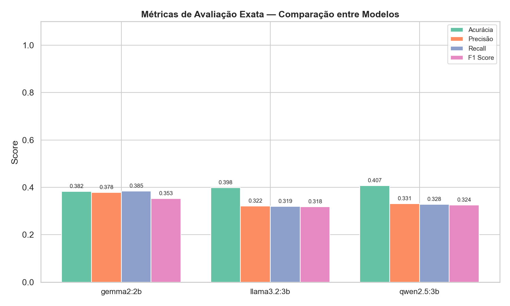


### Perfil geral dos modelos

O gráfico radar oferece uma visão consolidada do equilíbrio de cada modelo entre as quatro métricas. Um modelo com desempenho homogêneo aparece com um polígono mais simétrico. Aqui, o **gemma2:2b** apresenta o perfil mais equilibrado e amplo.


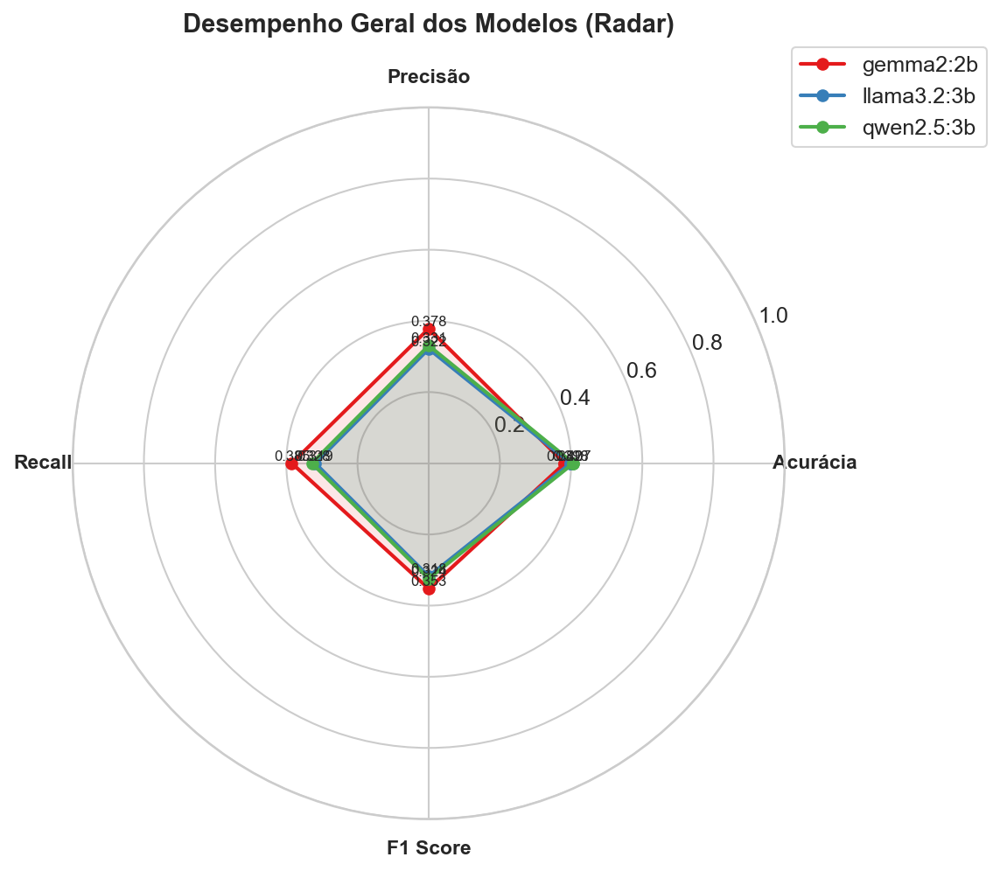


---

## OAB Bench: Avaliação cruzada

O dataset OAB Bench trabalha com questões dissertativas que não possuem gabarito objetivo. Por isso, a avaliação foi feita de duas formas: comparação entre as respostas dos próprios modelos (avaliação cruzada) e comparação com a guideline de referência.

### Métricas de similaridade (Média)
#### 🔹 Modelo Principal: gemma2-2b
| Comparação | BLEU | ROUGE-1 | ROUGE-2 | ROUGE-L | BERTScore F1 |
|---|---|---|---|---|---|
| **gemma2:2b vs llama3.2:3b** | 0.1315 | 0.4595 | 0.1831 | 0.2409 | 0.7322 |
| **gemma2:2b vs qwen2.5:3b** | 0.1033 | 0.4873 | 0.1788 | 0.2280 | 0.7367 |
| **gemma2:2b vs guideline** | 0.0197 | 0.1494 | 0.0505 | 0.1058 | 0.6520 |
#### 🔹 Modelo Principal: llama3.2-3b
| Comparação | BLEU | ROUGE-1 | ROUGE-2 | ROUGE-L | BERTScore F1 |
|---|---|---|---|---|---|
| **gemma2:2b vs llama3.2:3b** | 0.1315 | 0.4595 | 0.1831 | 0.2409 | 0.7322 |
| **llama3.2:3b vs qwen2.5:3b** | 0.1152 | 0.4778 | 0.1863 | 0.2359 | 0.7348 |
| **llama3.2:3b vs guideline** | 0.0236 | 0.1623 | 0.0605 | 0.1151 | 0.6534 |
#### 🔹 Modelo Principal: qwen2.5-3b
| Comparação | BLEU | ROUGE-1 | ROUGE-2 | ROUGE-L | BERTScore F1 |
|---|---|---|---|---|---|
| **gemma2:2b vs qwen2.5:3b** | 0.1033 | 0.4873 | 0.1788 | 0.2280 | 0.7367 |
| **llama3.2:3b vs qwen2.5:3b** | 0.1152 | 0.4778 | 0.1863 | 0.2359 | 0.7348 |
| **qwen2.5:3b vs guideline** | 0.0225 | 0.1417 | 0.0521 | 0.0976 | 0.6529 |

### Heatmap de similaridade semântica (BERTScore F1)

O heatmap abaixo mostra a similaridade semântica entre todos os pares de modelos e a guideline, medida pelo BERTScore F1. Os modelos apresentam alta concordância entre si (valores acima de 0.73), mas a similaridade com a guideline é notavelmente menor (em torno de 0.65), o que indica que, embora os modelos concordem entre si, suas respostas se distanciam do padrão de referência.


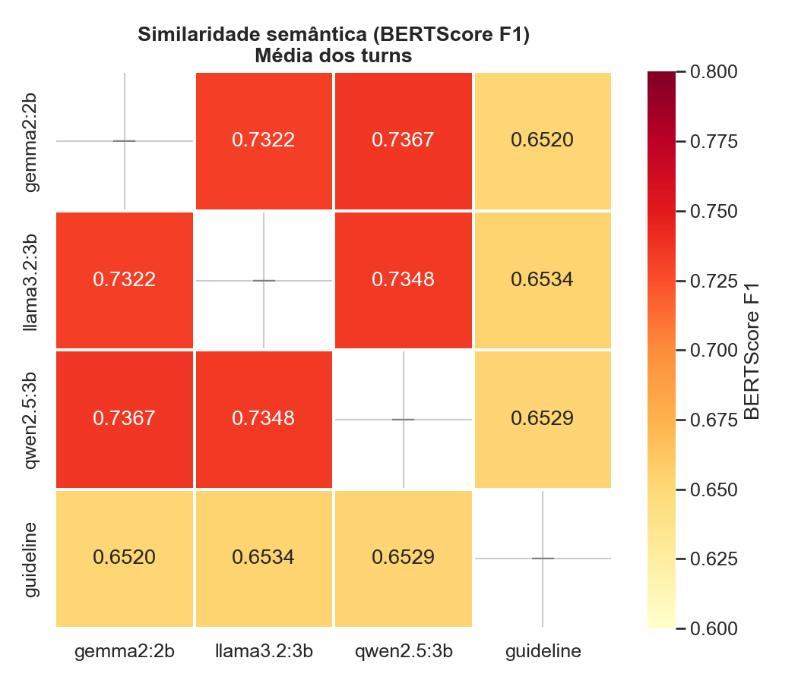


### Comparação entre modelos: Métricas de similaridade

O gráfico a seguir compara todas as métricas de similaridade textual entre os pares de modelos. O BERTScore F1 é consistentemente a métrica mais alta, enquanto o BLEU permanece bastante baixo. Isso é esperado, já que o BERTScore captura semântica contextual, enquanto o BLEU depende de correspondência exata de n-gramas.


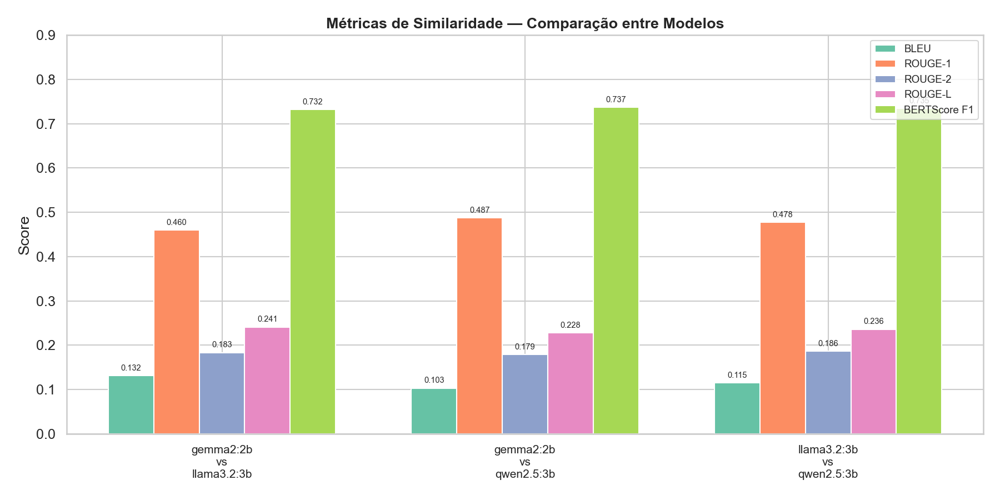


### Aderência dos modelos à guideline de referência

Este gráfico mostra o quanto cada modelo se aproxima da guideline oficial. Os valores baixos de BLEU e ROUGE indicam que os modelos não reproduzem literalmente o texto de referência. Porém, o BERTScore em torno de 0.65 sugere que há certa proximidade semântica, ainda que limitada.


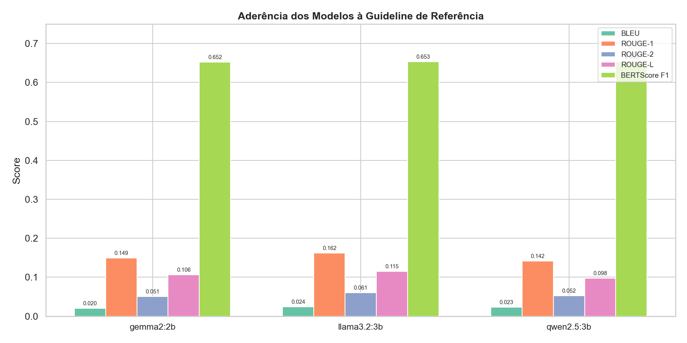


### Perfil de métricas: Modelo vs Guideline

Os gráficos radar permitem visualizar o perfil de cada modelo em relação à guideline. Todos apresentam um padrão semelhante: alta concentração no BERTScore F1 e valores baixos nas demais métricas, o que reforça a diferença entre similaridade lexical e semântica.


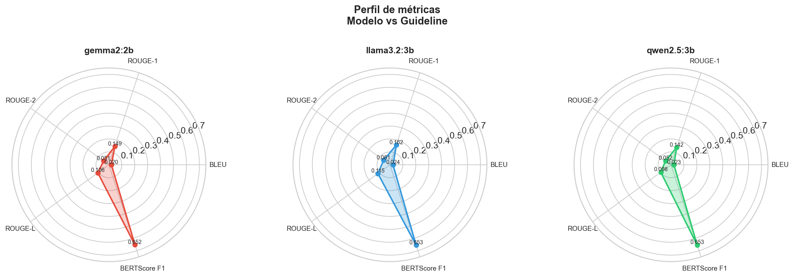


### BERTScore F1 por Turn

A análise por turn revela que o Turn 1 tende a apresentar scores ligeiramente superiores ao Turn 2 em praticamente todos os pares. Isso pode indicar que a segunda parte das questões exige respostas mais específicas, nas quais os modelos divergem mais.


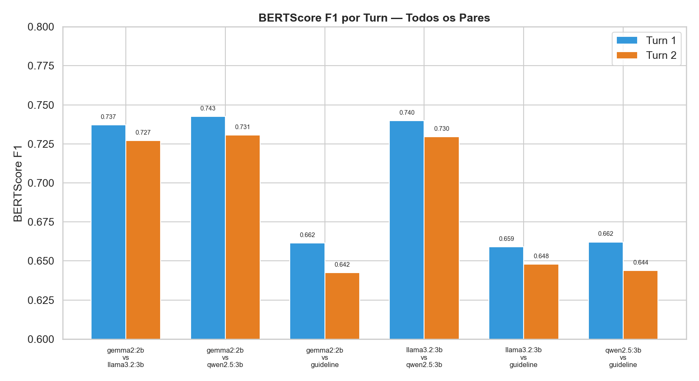


### Score médio do juiz

Além das métricas automáticas, um modelo juiz (GPT-4o-mini) foi utilizado para avaliar a qualidade das respostas. O **qwen2.5:3b** obteve o maior score médio (0.189), seguido pelo **llama3.2:3b** (0.139) e **gemma2:2b** (0.120). Os valores baixos refletem a dificuldade geral dos modelos compactos com questões jurídicas dissertativas.


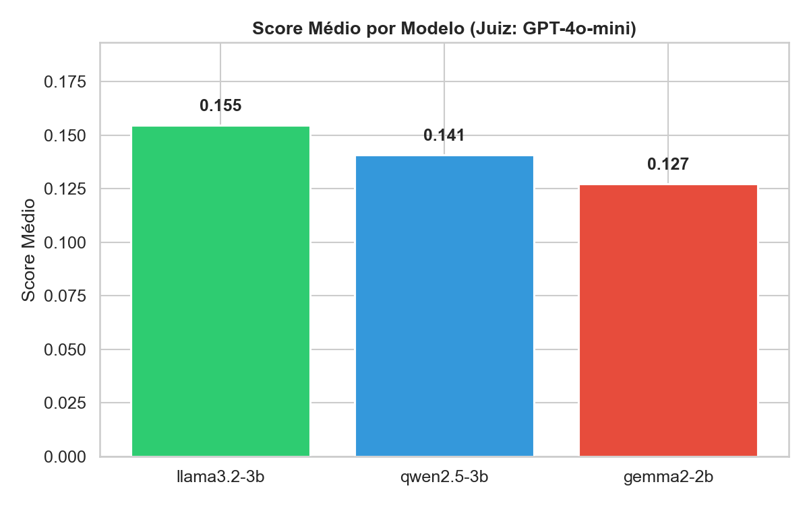


### Score do juiz por modelo e turn

A desagregação por turn mostra comportamentos distintos entre os modelos. O **llama3.2:3b** tem um salto expressivo do Turn 1 (0.083) para o Turn 2 (0.205), enquanto o **qwen2.5:3b** apresenta comportamento inverso, com queda no Turn 2. Isso sugere diferentes capacidades de aprofundamento entre os modelos.


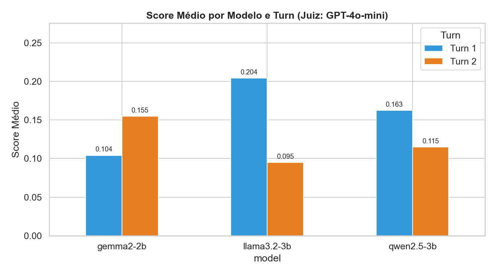


### Distribuição dos scores

O boxplot evidencia que a maioria das avaliações do juiz ficou concentrada em valores baixos (próximos de 0), com outliers pontuais acima de 0.4. O **qwen2.5:3b** apresenta a maior mediana e o maior spread, indicando maior variabilidade mas também mais respostas de qualidade aceitável.


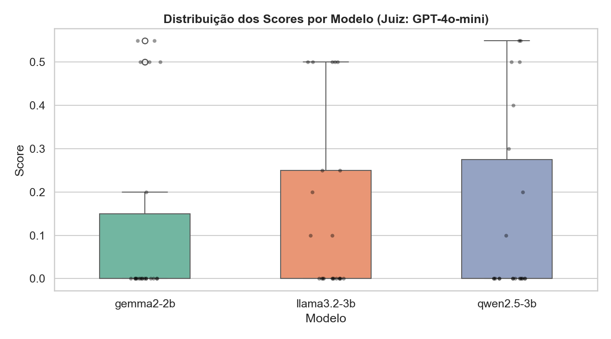


### Scores por questão e modelo

O heatmap detalhado por questão mostra que o desempenho varia bastante conforme o tema. Questões de direito administrativo tiveram melhor desempenho geral, enquanto questões de direito do trabalho foram as mais difíceis para todos os modelos. Nota-se também que nenhum modelo domina todas as questões.


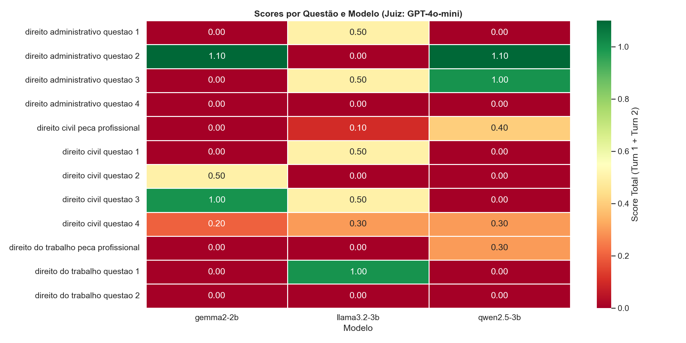


### Correlação: BERTScore vs Nota do Juiz

O gráfico de dispersão mostra a relação entre a similaridade com a guideline (BERTScore F1) e a nota atribuída pelo juiz. Um ponto interessante é que o **qwen2.5:3b**, apesar de ter o menor BERTScore contra a guideline, obteve a maior nota do juiz. Isso sugere que proximidade textual com a referência não garante necessariamente qualidade jurídica percebida.


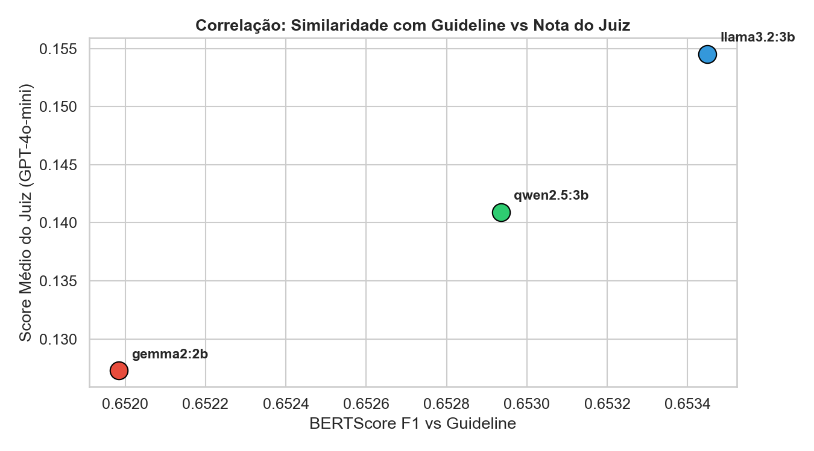


## Estrutura de diretórios da branch `results`

A branch `results` organiza todos os artefatos gerados pelo pipeline de avaliação. Abaixo está a descrição de cada diretório:

```
├── debug/                          # Logs de depuração das chamadas aos LLMs
│   ├── gemma2_2b/
│   ├── llama3.2_3b/
│   ├── qwen2.5_3b/
│   └── gpt-4o-mini/
└── results/
    ├── oab_bench/                  # Resultados das questões dissertativas
    │   ├── charts/                 # Gráficos gerados automaticamente
    │   ├── model_answer/           # Respostas brutas de cada modelo (JSON)
    │   ├── model_judgment/         # Avaliações do modelo juiz (GPT-4o-mini)
    │   └── model_metric/           # Métricas calculadas por modelo (JSON)
    └── oab_exams/                  # Resultados das questões objetivas
        ├── charts/                 # Gráficos gerados automaticamente
        ├── model_answer/           # Respostas brutas de cada modelo (JSON)
        └── model_metric/           # Métricas calculadas por modelo (JSON)
```

O diretório **`debug/`** contém os registros detalhados de cada chamada feita aos modelos de linguagem, incluindo o prompt de sistema, o prompt do usuário e a resposta gerada. Essa pasta só é populada quando a variável de ambiente `LLM_DEBUG=1` está ativa, sendo útil para inspecionar o comportamento dos modelos durante a inferência e o julgamento.

Dentro de **`results/`**, cada dataset possui sua própria estrutura com os seguintes subdiretórios:

- **`model_answer/`** são respostas brutas geradas por cada modelo, salvas em formato JSON.
- **`model_metric/`** são métricas calculadas automaticamente pelo comando `evaluate`.
- **`model_judgment/`** são avaliações qualitativas produzidas pelo modelo juiz (presente apenas no OAB Bench).
- **`charts/`** são gráficos gerados a partir das métricas coletadas.