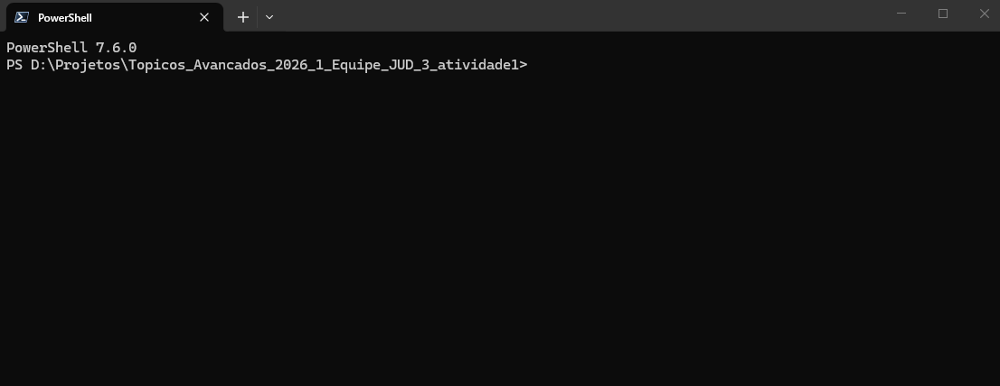

# Instalação

Esta página mostra como preparar o ambiente do projeto, instalar as
dependências e baixar os modelos utilizados nas execuções locais.

## Clonar o repositório

Clone o repositório oficial e acesse o diretório do projeto:

```bash
git clone https://github.com/reinanhs/Topicos_Avancados_2026_1_Equipe_JUD_3_atividade1.git
cd Topicos_Avancados_2026_1_Equipe_JUD_3_atividade1
````

## Criar e ativar o ambiente virtual

Crie um ambiente virtual Python para isolar as dependências do projeto:

```bash
python -m venv .venv
```

Ative o ambiente de acordo com o sistema operacional:

### Linux e macOS

```bash
source .venv/bin/activate
```

### Windows com PowerShell

```powershell
.venv\Scripts\activate
```

## Instalar as dependências

Com o ambiente virtual ativado, execute o comando abaixo para instalar as
dependências do projeto:

```bash
uv sync
```

## Baixar os modelos no Ollama

Baixe os modelos utilizados no projeto com os comandos abaixo:

```bash
ollama pull llama3.2:3b
ollama pull gemma2:2b
ollama pull qwen2.5:3b
```

Esses comandos fazem o download dos modelos configurados para as execuções
locais da atividade.

## Verificar a instalação

Após concluir a instalação, execute o comando abaixo para verificar se a CLI do
projeto está disponível:

```bash
uv run reinan-cli --help
```

Se a instalação estiver correta, a saída deverá exibir os comandos disponíveis,
como `pull`, `run` e `evaluate`.

## Exemplo visual

A imagem abaixo mostra um exemplo do processo de instalação em execução:


