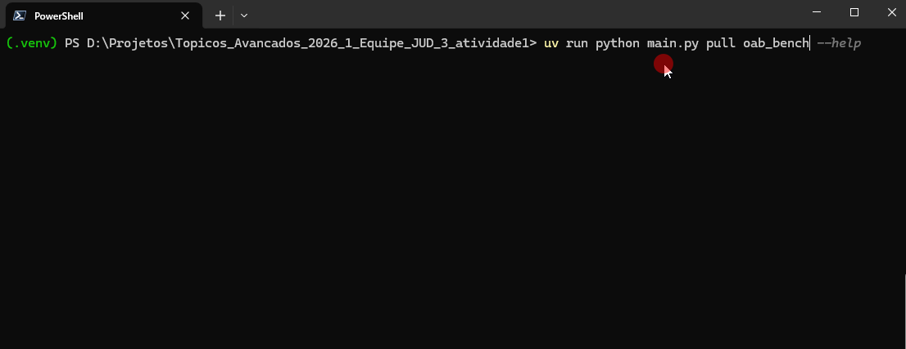

# Guia rápido

Esta página mostra um fluxo mínimo para executar o projeto, desde o download dos
datasets até a avaliação dos resultados.

## Baixar os datasets

Use os comandos abaixo para baixar os datasets utilizados no projeto:

```bash
uv run python main.py pull oab_bench
uv run python main.py pull oab_exams
````

Essa etapa é opcional. Quando executado, o comando baixa os dados e os salva na
pasta `.reinan_cache/dataset/`.

Exemplo de saída:

```text
Foram selecionadas 12 questões para o lote.
Conjunto de dados salvo com sucesso em: .reinan_cache\dataset\oab_bench.json
```

Também é possível usar a flag `--output` para definir o formato do arquivo de
saída. Os formatos disponíveis são `json` e `csv`. O valor padrão é `json`.

## Executar a inferência

### Executar no dataset `oab_bench`

```bash
uv run python main.py run oab_bench --model llama3.2:3b
uv run python main.py run oab_bench --model gemma2:2b
uv run python main.py run oab_bench --model qwen2.5:3b
```

### Executar no dataset `oab_exams`

```bash
uv run python main.py run oab_exams --model llama3.2:3b
uv run python main.py run oab_exams --model gemma2:2b
uv run python main.py run oab_exams --model qwen2.5:3b
```

Os resultados gerados nessa etapa são salvos no diretório
`.reinan_cache/results`. Esses arquivos são utilizados posteriormente no
processo de avaliação das respostas e no cálculo das métricas.

## Avaliar os resultados

Depois de concluir a inferência, execute os comandos abaixo para calcular as
métricas de avaliação:

```bash
uv run python main.py evaluate oab_bench
uv run python main.py evaluate oab_exams
```

## Resultado esperado

Ao final da execução, os resultados estarão disponíveis no diretório
`.reinan_cache/results` e poderão ser visualizados no dashboard do projeto.

## Exemplo visual

A imagem abaixo mostra um exemplo do processo de execução:


