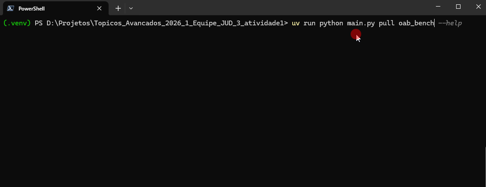

# Guia rápido

Esta página mostra um fluxo mínimo para executar o projeto, desde o download dos
datasets até a geração dos relatórios finais.

## Execução completa (pipeline)

O comando **`run-all`** executa o pipeline completo do projeto de ponta a ponta.
Esta é a forma mais simples de rodar tudo com um único comando:

```bash
uv run reinan-cli run-all
```

Ao ser executado, o `run-all` realiza automaticamente os **12 passos** listados
abaixo, na ordem:

| Passo | Comando equivalente  | Descrição                                                                                            |
|:-----:|----------------------|------------------------------------------------------------------------------------------------------|
| 01/12 | `pull oab_bench`     | Baixa o dataset `oab_bench` e salva em `.reinan_cache/dataset/`                                      |
| 02/12 | `pull oab_exams`     | Baixa o dataset `oab_exams` e salva em `.reinan_cache/dataset/`                                      |
| 03/12 | `infer oab_bench`    | Executa a inferência no `oab_bench` para todos os modelos (`llama3.2:3b`, `gemma2:2b`, `qwen2.5:3b`) |
| 04/12 | `infer oab_exams`    | Executa a inferência no `oab_exams` para todos os modelos                                            |
| 05/12 | `evaluate oab_bench` | Calcula métricas de avaliação cruzada (Pairwise Metrics)                                             |
| 06/12 | `evaluate oab_exams` | Calcula métricas de avaliação exata (Acurácia, Precisão, Recall, F1)                                 |
| 07/12 | `judgment oab_bench` | Gera julgamentos via LLM as a Judge (modelo juiz padrão: `gpt-5.2`)                                  |
| 08/12 | `curate oab_bench`   | Classifica dificuldade, legislação e área de cada questão                                            |
| 09/12 | `curate oab_exams`   | Classifica dificuldade, legislação e área de cada questão                                            |
| 10/12 | `report oab_bench`   | Gera gráficos e métricas visuais do `oab_bench`                                                      |
| 11/12 | `report oab_exams`   | Gera gráficos e métricas visuais do `oab_exams`                                                      |
| 12/12 | `build-readme`       | Gera o `README.md` consolidado dentro de `.reinan_cache/`                                            |

### Opções do `run-all`

| Flag               | Descrição                                                    |
|--------------------|------------------------------------------------------------- |
| `--limit` / `-l`   | Limitar a quantidade de questões na etapa de inferência.     |
| `--judge` / `-j`   | Modelo juiz para curadoria. Padrão: `gpt-4o-mini`.          |

Exemplo limitando a inferência a 5 questões:

```bash
uv run reinan-cli run-all --limit 5
```

Ao final o CLI exibe o tempo total de execução do pipeline.

---

## Execução separada (passo a passo)

Também é possível executar cada etapa individualmente. Isso é útil para reprocessar apenas uma parte do pipeline ou para obter maior controle sobre as opções de cada comando.

### 1. Baixar os datasets `pull`

```bash
uv run reinan-cli pull oab_bench
uv run reinan-cli pull oab_exams
```

Essa etapa baixa os dados da Hugging Face e os salva na pasta `.reinan_cache/dataset/`.

Exemplo de saída:

```text
Foram selecionadas 12 questões para o lote.
Conjunto de dados salvo com sucesso em: .reinan_cache\dataset\oab_bench.json
```

Também é possível usar a flag `--output` para definir o formato do arquivo de saída. Os formatos disponíveis são `json` e `csv`. O valor padrão é `json`.

### 2. Gerar o banco de dados vetorial `rag-populate`

Antes de executar inferências com RAG, você precisa popular o banco ChromaDB indexando as legislações HTML presentes na pasta `database/rag/`:

```bash
uv run reinan-cli rag-populate
```

Opções disponíveis:
- `--db-path`: Caminho onde o ChromaDB será gravado. Padrão: `.reinan_cache/chromadb`.
- `--collection`: Nome da coleção no ChromaDB. Padrão: `legislacao`.
- `--model`: Modelo de embedding a ser invocado no Ollama. Padrão: `qwen3-embedding:8b`.

### 3. Executar a inferência `infer`

Executa a inferência e a classificação de dificuldade nas questões do dataset utilizando os modelos locais via Ollama.

#### Executar para todos os modelos

```bash
uv run reinan-cli infer oab_bench
uv run reinan-cli infer oab_exams
```

#### Executar para um modelo específico

```bash
uv run reinan-cli infer oab_bench --model llama3.2:3b
uv run reinan-cli infer oab_exams --model gemma2:2b
```

#### Limitar a quantidade de questões

```bash
uv run reinan-cli infer oab_bench --model qwen2.5:3b --limit 10
uv run reinan-cli infer oab_exams --limit 5
```

#### Executar com RAG (Retrieval-Augmented Generation)

Para enriquecer o prompt das questões com artigos e leis relevantes recuperados do banco vetorial:

```bash
uv run reinan-cli infer oab_bench --model qwen2.5:3b --limit 5 --rag
```

A flag `--rag` ativa a busca híbrida semântica na base de legislação indexada no ChromaDB antes de enviar a questão para o modelo, fornecendo o contexto legal necessário para a resposta. Você também pode definir a quantidade de trechos a recuperar usando a opção `--top-k` (padrão: 10):

```bash
uv run reinan-cli infer oab_bench --model qwen2.5:3b --limit 5 --rag --top-k 5
```

Os resultados gerados nessa etapa são salvos no diretório `.reinan_cache/results`.

### 4. Avaliar os resultados `evaluate`

Depois de concluir a inferência, execute os comandos abaixo para calcular as métricas de avaliação:

```bash
uv run reinan-cli evaluate oab_bench
uv run reinan-cli evaluate oab_exams
```

- **`oab_bench`** utiliza avaliação cruzada (Pairwise Metrics) entre pares de modelos. Requer no mínimo 2 modelos com resultados salvos.
- **`oab_exams`** utiliza avaliação exata (Acurácia, Precisão, Recall, F1). Requer no mínimo 1 modelo com resultados salvos.

Para avaliar resultados gerados a partir do RAG, adicione a flag `--rag`:
```bash
uv run reinan-cli evaluate oab_bench --rag
uv run reinan-cli evaluate oab_exams --rag
```

### 5. Julgamento via LLM `judgment`

Gera registros de julgamento (*LLM as a Judge*) para as respostas dos modelos. Disponível apenas para o dataset `oab_bench`.

```bash
uv run reinan-cli judgment oab_bench
```

Opções disponíveis:

```bash
# Escolher o modelo juiz (padrão: gpt-5.2)
uv run reinan-cli judgment oab_bench --judge gpt-5.2

# Julgar apenas as respostas de um modelo específico
uv run reinan-cli judgment oab_bench --model llama3.2:3b

# Limitar a quantidade de respostas julgadas por modelo
uv run reinan-cli judgment oab_bench --limit 10

# Julgar respostas geradas pelo pipeline com RAG
uv run reinan-cli judgment oab_bench --rag
```

### 6. Curadoria `curate`

Gera informações de curadoria (dificuldade, legislação e área) para as questões do dataset, utilizando um modelo juiz LLM.

```bash
uv run reinan-cli curate oab_bench
```

Opções disponíveis:

```bash
# Escolher o modelo curador (padrão: gpt-4o-mini)
uv run reinan-cli curate oab_bench --judge gpt-4o-mini

# Limitar a quantidade de questões analisadas
uv run reinan-cli curate oab_exams --limit 10
```

### 7. Gerar relatórios `report`

Processa os resultados e gera gráficos de métricas:

```bash
uv run reinan-cli report oab_bench
uv run reinan-cli report oab_exams
```

Para gerar relatórios e gráficos específicos dos experimentos com RAG, adicione a flag `--rag`:
```bash
uv run reinan-cli report oab_bench --rag
uv run reinan-cli report oab_exams --rag
```

### 8. Gerar README consolidado `build-readme`

Gera o arquivo `README.md` consolidado dentro da pasta `.reinan_cache/`, pronto para ser publicado na branch de visualização dos resultados:

```bash
uv run reinan-cli build-readme
```

Para gerar a tabela consolidada de resultados usando RAG:
```bash
uv run reinan-cli build-readme --rag
```

### 9. Publicar resultados `publish`

Publica os resultados estáticos (pasta `.reinan_cache/`, exceto o `dataset`) em uma branch separada:

```bash
uv run reinan-cli publish
```

Por padrão a branch de destino é `results`. Utilize `--branch` para alterar:

```bash
uv run reinan-cli publish --branch gh-pages
```

---

## Testes e Validação do RAG

Para garantir a qualidade e corretude do fluxo de recuperação e do processador de documentos, o projeto inclui uma suíte de comandos voltados exclusivamente para testes.

### 1. Testar o fatiador de documentos (`rag-test-chunker`)
Valida o processo de quebra de texto (chunking) dos arquivos HTML da legislação sem gerar embeddings ou escrever no banco. É ideal para validar o funcionamento do parser linear por artigos:

```bash
uv run reinan-cli rag-test-chunker
```

Para testar apenas uma lei específica e aumentar o tamanho do preview impresso:
```bash
uv run reinan-cli rag-test-chunker --file L14133.html --preview-limit 10
```

### 2. Consultar a base vetorial diretamente (`rag-query`)
Executa uma busca híbrida diagnóstica diretamente sobre o banco ChromaDB populado. Exibe os scores vetoriais, lexicais e os boosts aplicados na fase de re-ranqueamento:

```bash
uv run reinan-cli rag-query --query "Qual o prazo de prescrição da pretensão punitiva?" --top-k 3
```

### 3. Executar o teste de regressão (`rag-test-regression`)
Roda um teste que valida se a busca é capaz de contornar um caso crítico conhecido (Questão 2016-21_38). Esse teste garante que o Artigo 156 do Código Civil (estado de perigo) seja priorizado nos primeiros resultados e que artigos irrelevantes de contrato de transporte sejam penalizados e rebaixados.

```bash
uv run reinan-cli rag-test-regression
```

---

## Modo debug

Para ativar o modo de depuração das chamadas LLM, defina a variável de ambiente `LLM_DEBUG` antes de executar qualquer comando:

**PowerShell:**

```powershell
$env:LLM_DEBUG="1"
uv run reinan-cli run-all
```

**Bash / Linux / macOS:**

```bash
export LLM_DEBUG=1
uv run reinan-cli run-all
```

Com o debug ativado, cada chamada ao LLM salva automaticamente os seguintes arquivos no diretório `.reinan_cache/debug/<modelo>/`:

- `system_prompt.md`  o prompt de sistema enviado ao modelo.
- `user_prompt.md`  o prompt do usuário enviado ao modelo.
- `response.md`  a resposta gerada pelo modelo.
- `chat_history.md`  o histórico completo de mensagens (para chamadas multi-turn).

Essa funcionalidade é útil para inspecionar o comportamento dos modelos durante a inferência, julgamento e curadoria.

## Resultado esperado

Ao final da execução, os resultados estarão disponíveis no diretório `.reinan_cache/results` e poderão ser visualizados no dashboard do projeto.

## Exemplo visual

A imagem abaixo mostra um exemplo do processo de execução:



