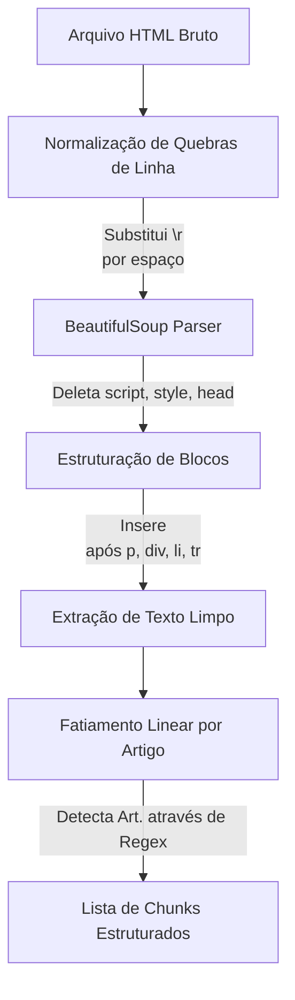

# Quebra de Texto (Chunking)

A eficiência de um sistema RAG em domínios altamente especializados, como o Direito, depende crucialmente da qualidade dos fragmentos (*chunks*) indexados. Esta seção detalha os desafios de trabalhar com legislação brasileira e a estratégia construída no módulo `src/rag/chunker.py`.

---

## Os Problemas das Abordagens Tradicionais

### 1. Divisão por Tamanho Fixo (Character-based Splitters)
Modelos comuns de processamento de texto usam delimitadores como tamanho de caracteres fixo (ex: 500 caracteres) com uma pequena sobreposição (*overlap*). Aplicar isso à legislação destrói a coerência:
- Um artigo pode ser dividido ao meio, separando um parágrafo de seu caput.
- O modelo perde referências cruzadas internas (ex: a explicação de um inciso está no final do texto do artigo, mas o fatiador colocou-os em chunks diferentes).

### 2. Quebras de Linha Espúrias nos HTMLs Oficiais (Site do Planalto)
Os arquivos de legislação em `database/rag` são páginas HTML extraídas de órgãos oficiais. Por terem sido gerados historicamente por softwares antigos (como o Microsoft FrontPage), eles contêm particularidades:
- Elementos de texto inline interrompidos por quebras de linha brutas (`\n`) no meio de frases ou até mesmo de expressões formais, como:
  ```html
  Art.
  2º Esta lei estabelece...
  ```
- Se fizermos um fatiamento linha a linha direto ou tentarmos buscar expressões regulares em linhas isoladas, o parser falhará ao ignorar a declaração de diversos artigos.

---

## A Solução: Divisão Semântica por Artigos (Linear Chunker)

Nossa abordagem implementa uma quebra de texto focada na **estrutura formal da lei brasileira** (artigos, parágrafos, incisos e alíneas). Garantimos que cada artigo represente exatamente um chunk autocontido.



### O Pipeline de Processamento do `LegislationChunker`:

1. **Fusão de Linhas Inline (`clean_html_to_lines`)**:
   Antes de renderizar o HTML, substituímos todas as quebras de linha existentes (`\r` e `\n`) por espaços simples. Isso garante que qualquer termo inline quebrado em duas linhas seja fundido novamente (ex: `"Art. \n 2º"` vira `"Art. 2º"`).

2. **Limpeza e Decapagem com BeautifulSoup**:
   Lemos a string normalizada e removemos permanentemente tags não textuais que trazem ruído (como `<style>`, `<script>`, `<head>`, `<meta>` e `<title>`).

3. **Reintrodução de Limites de Bloco**:
   Para preservar a separação real de parágrafos, tabelas e listas, percorremos o DOM e inserimos uma nova linha real (`\n`) logo após as tags de bloco comuns (`p`, `div`, `tr`, `h1`-`h6`, `li`, `br`).

4. **Escaneamento e Agrupamento por Regex (`chunk_file`)**:
   Extraímos o texto limpo, dividimos por linhas e removemos espaços em branco vazios. Percorremos as linhas sequencialmente:
   - Se uma linha começa com o padrão `Art.` ou `Artigo` seguido de numeração (através da expressão regular `^(art\.\s*\d+|art\s+\d+|artigo\s+\d+)`), encerramos o chunk anterior.
   - Iniciamos um novo chunk cujo título do artigo é a numeração identificada.
   - Qualquer linha subsequente que não comece com esse padrão (que representam parágrafos como `§ 1º`, incisos como `I -`, alíneas como `a)`) é concatenada ao chunk do artigo atual.

---

## Resultados da Estratégia

Ao indexar a **Nova Lei de Licitações (Lei 14.133/2021)**:
- Abordagens tradicionais baseadas em linha extraíam apenas 32 artigos por conta de quebras internas.
- O `LegislationChunker` extraiu exatamente **213 chunks**, cobrindo com precisão cirúrgica a integridade dos artigos originais da lei.
