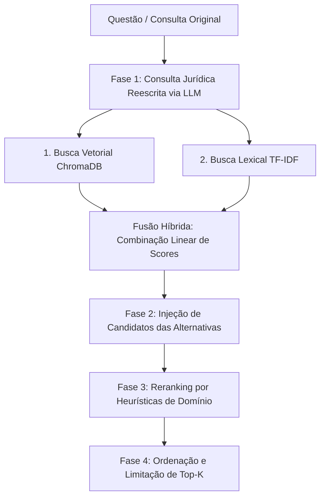

# Estratégia de Ranqueamento e Re-ranqueamento (Reranking)

A eficácia de um sistema RAG em domínios específicos e de alta precisão (como o Exame da OAB) não depende apenas da capacidade do modelo de embeddings em aproximar semanticamente a query dos documentos. Em muitos casos, ruídos cenográficos do enunciado (como mencionar termos de viagens aéreas, piscinas ou pizzarias) causam desvios vetoriais que trazem artigos irrelevantes de contratos de transporte ou de vizinhança.

Para contornar esse desafio, nosso sistema em `src/rag/database.py` utiliza um pipeline de **Busca Híbrida** associado a um mecanismo personalizado de **Re-ranqueamento por Heurísticas (Reranking)**.

---

## O Pipeline de Busca e Ranqueamento

O processo de busca na base de dados legislativa é executado nas quatro etapas descritas a seguir:

### 1. Escrita de Consulta Jurídica (Query Expansion/Rewriting)
O enunciado da questão contém diversos elementos narrativos. Chamamos o LLM (`gemma2:2b` ou outro disponível) com um prompt de sistema para extrair apenas uma query jurídica curta e densa (ex: convertendo uma história de mal súbito em avião em "estado de perigo anulação coação").
* Se a chamada ao LLM falhar, o sistema adota um **mecanismo de fallback heurístico**, selecionando palavras-chave jurídicas pré-mapeadas e anexando os termos presentes nas alternativas da questão.

### 2. Recuperação Híbrida (Fusão Vetorial + Lexical)
A busca na base ChromaDB é feita em duas frentes:
1. **Busca Vetorial**: O embedding da query jurídica reescrita é gerado com o `qwen3-embedding:8b` e pesquisado no ChromaDB. As distâncias vetoriais (L2) são normalizadas para um score de similaridade:
   $$vector\_score = \frac{1.0}{1.0 + L2\_distance}$$
2. **Busca Lexical (TF-IDF)**: Um vetorizador baseado em TF-IDF (`LexicalRetriever` em `src/rag/lexical.py`) calcula a correlação literal de termos entre a query jurídica e todos os artigos cadastrados na base, retornando um `lexical_score`.

Os scores iniciais das duas buscas são agregados linearmente em uma média simples (50% cada) para compor o score híbrido base:
$$base\_score = 0.5 \times vector\_score + 0.5 \times lexical\_score$$

### 3. Injeção de Candidatos (Alternativas da Questão)
Como as alternativas corretas costumam citar explicitamente artigos ou institutos da lei, o sistema analisa os textos das opções da questão. Se algum artigo na base de dados contiver textualmente os termos presentes nas alternativas, ele é injetado como candidato à lista (mesmo que não tenha sido recuperado nas etapas de busca lexical ou vetorial preliminares).

---

## 4. Re-ranqueamento Heurístico (Reranking)

Após consolidar a lista unificada de candidatos, o método `rerank()` aplica regras específicas do domínio jurídico brasileiro. Cada candidato pode receber bonificações (*boost*) ou penalidades (*penalty*) baseadas em metadados:

### A. Correspondência de Área Jurídica (Boost de +0.25)
Se a questão for mapeada para a área de *Direito Civil* e o artigo indexado no ChromaDB for oriundo do Código Civil (ou classificado com essa área), o candidato recebe um acréscimo no score:
$$score = base\_score + 0.25$$

### B. Correspondência com Alternativas (Boost de +0.35 a +0.85)
Os termos presentes nas alternativas são cruzados com o texto de cada candidato:
* Se o texto do artigo contiver um termo simples das alternativas: **+0.35** de boost.
* Se contiver um termo composto (frase com espaços, indicando um conceito jurídico estruturado): **+0.85** de boost.
Todos os boosts correspondentes às alternativas compatíveis são somados cumulativamente.

### C. Penalização Narrativa (Penalidade de -0.50 por termo)
Para neutralizar artigos irrelevantes que sobem no ranking por coincidência cenográfica (ex: artigos de contrato de transporte ao lidar com acidentes em voos), definimos uma lista de termos narrativos puramente cênicos (como `"viagem"`, `"passageiro"`, `"piloto"`, `"aeroporto"`, `"piscina"`, `"pizzaria"`, `"remedio"`, etc.).
* Se o candidato contiver termos dessa lista **E** não contiver nenhum conceito jurídico relevante presente nas alternativas de múltipla escolha:
$$penalty = 0.50 \times quantidade\_de\_termos\_narrativos$$
Essa penalidade reduz de forma expressiva a pontuação do trecho e o rebaixa do topo.

---

## Desacoplamento da Arquitetura

O sistema de re-ranqueamento foi propositalmente encapsulado no método `rerank()` da classe `LegislationVectorDB`. 

Esta modelagem desacoplada permite que, no futuro, as heurísticas estáticas baseadas em regras de boost/penalidade sejam substituídas ou integradas a um **Reranker Neural** (como modelos baseados em arquiteturas *Cross-Encoder* de redes neurais do Hugging Face ou APIs proprietárias como Cohere Rerank) de maneira transparente, sem alterar a interface dos executores ou da CLI.
